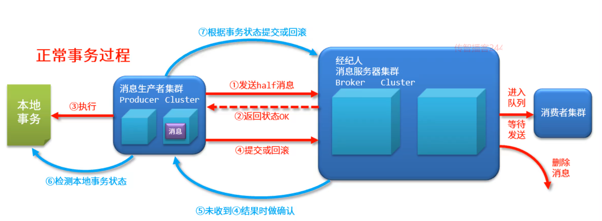

# RocketMQ_day01

# 1 概述

​	MQ（Message Queue）消息队列，是一种用来保存消息数据的队列

​	队列：数据结构的一种，特征为 “先进先出”


# 2.MQ 的作用

- 应用解耦(技术上必须弄好才能使用MQ )

- 快速应用变更维护

- 流量削锋(削峰填谷)


# 3.MQ的优缺点

缺点:

```
1系统可用性降低:  集群
2系统复杂度提高:(程序员提升水平)
3异步消息机制(都有解决方案)
	消息顺序性
	消息丢失
	消息一致性
	消息重复使用	

```

# 4.常见产品

```
ActiveMQ：java语言实现，万级数据吞吐量，处理速度ms级，主从架构，成熟度高
RabbitMQ ：erlang语言实现，万级数据吞吐量，处理速度us级，主从架构，
RocketMQ ：java语言实现，十万级数据吞吐量，处理速度ms级，分布式架构，功能强大，扩展性强
kafka ：scala语言实现，十万级数据吞吐量，处理速度ms级，分布式架构，功能较少，应用于大数据较多

```

简介

RocketMQ是阿里开源的一款非常优秀中间件产品，脱胎于阿里的另一款队列技术MetaQ，后捐赠给Apache基金会作为一款孵化技术，仅仅经历了一年多的时间就成为Apache基金会的顶级项目。并且它现在已经在阿里内部被广泛的应用，并且经受住了多次双十一的这种极致场景的压力（2017年的双十一，RocketMQ流转的消息量达到了万亿级，峰值TPS达到5600万）
解决所有缺点

# 5.安装


## jdk

```
1)解压 jdk
tar -zxvf jdk-8u171-linux-x64.tar.gz
2)配置环境变量
>vim /etc/profile
export JAVA_HOME=/opt/jdk1.8.0_171
export PATH=$PATH:${JAVA_HOME}/bin
3)重新加载配置
>source /etc/profile
>java -version
```

错误解决

```
如果安装完毕 jdk 后  java -version 看到的是 openjdk(需要删除)
因为 操作系统默认已经安装了 opendjdk,
# 查看
rpm -qa | grep java
# 删除(把上一个命令看到的所有的jdk文件 用 如下命令删除)
rpm -e --nodeps java-1.8.0-openjdk-1.8.0.232.b09-0.el7_7.x86_64
rpm -e --nodeps java-1.8.0-openjdk-headless-1.8.0.232.b09-0.el7_7.x86_64
rpm -e --nodeps java-1.7.0-openjdk-headless-1.7.0.241-2.6.20.0.el7_7.x86_64
rmp -e --nodeps java-1.7.0-openjdk-1.7.0.241-2.6.20.0.el7_7.x86_64
rpm -e --nodeps java-1.7.0-openjdk-1.7.0.241-2.6.20.0.el7_7.x86_64
```


## rocketMQ

```
# 解压
unzip rocketmq-all-4.5.2-bin-release.zip
# 修改目录名称
mv rocketmq-all-4.5.2-bin-release rocketmq
```

```
# 调整启动内存 为128m
runserver.sh
runbroker.sh
```

如果和后天的课程(docker 一起 需要修改)

conf/broker.conf

```
brokerClusterName = DefaultCluster
brokerName = broker-a
brokerId = 0
deleteWhen = 04
fileReservedTime = 48
brokerRole = ASYNC_MASTER
flushDiskType = ASYNC_FLUS
# 解决和docker 冲突的
brokerIP1=192.168.31.80
namesrvAddr=192.168.31.80:9876
```

启动

```
#启动nameserv
sh mqnamesrv
# 启动mq  服务  -n 指定 nameserv 的地址(bin)
sh mqbroker -n localhost:9876  -c ../conf/broker.conf
```

```
# 关闭防火墙
systemctl stop firewalld.service 
```

测试

````
export NAMESRV_ADDR=localhost:9876
bin 目录
sh tools.sh org.apache.rocketmq.example.quickstart.Producer
sh tools.sh org.apache.rocketmq.example.quickstart.Consumer
````

# 6.使用

## 6.1  负载均衡


环境搭建

```xml
 <dependency>
            <groupId>org.apache.rocketmq</groupId>
            <artifactId>rocketmq-client</artifactId>
            <version>4.5.2</version>
</dependency>
```

消息


发送

```java
public static void main(String[] args) throws Exception {
        //1.创建一个发送消息的对象Producer
        DefaultMQProducer producer = new DefaultMQProducer("group1");
        //2.设定发送的命名服务器地址
        producer.setNamesrvAddr("192.168.31.80:9876");
        //3.1启动发送的服务
        producer.start();
        //4.创建要发送的消息对象,指定topic，指定内容body
        Message msg = new Message("topic1","hello rocketmq".getBytes("UTF-8"));
        //4.2发送消息
        SendResult result = producer.send(msg);
        System.out.println("返回结果："+result);
        //5.关闭连接
        producer.shutdown();
}
```

发送多个消息

```java
 for (int i = 1; i <= 10; i++) {
 Message msg = new Message("topic1",("生产者2： hello rocketmq "+i).getBytes("UTF-8"));
            SendResult result = producer.send(msg);
            System.out.println("返回结果："+result);
}
```


消费者

```java
public static void main(String[] args) throws Exception {
        //1.创建一个接收消息的对象Consumer
        DefaultMQPushConsumer consumer = new DefaultMQPushConsumer("group1");
        //2.设定接收的命名服务器地址
        consumer.setNamesrvAddr("192.168.31.80:9876");
        //3.设置接收消息对应的topic,对应的sub标签为任意*
        consumer.subscribe("topic1","*");
        //3.开启监听，用于接收消息
        consumer.registerMessageListener(new MessageListenerConcurrently() {
            public ConsumeConcurrentlyStatus consumeMessage(List<MessageExt> list, ConsumeConcurrentlyContext consumeConcurrentlyContext) {
                //遍历消息
                for(MessageExt msg : list){
//                    System.out.println("收到消息："+msg);
                    System.out.println("消息："+new String(msg.getBody()));
                }
                return ConsumeConcurrentlyStatus.CONSUME_SUCCESS;// 成功处理, mq 收到这个 标记后相同的消息讲不会再次发给消费者
            }
        });
        //4.启动接收消息的服务
        consumer.start();// 开启多线程 监控消息,持续运行
        System.out.println("接收消息服务已开启运行");
    }
```


## 6.2  广播模式

发送者

```
同上
```

消费者

```java
//1.创建一个接收消息的对象Consumer
        DefaultMQPushConsumer consumer = new DefaultMQPushConsumer("group1");
        System.out.println(consumer.getInstanceName());
        //consumer.setInstanceName("instance01");
        //2.设定接收的命名服务器地址
        consumer.setNamesrvAddr("192.168.31.80:9876");
        //3.设置接收消息对应的topic,对应的sub标签为任意*
        consumer.subscribe("topic1","*");

        //设置当前消费者的消费模式（默认模式：负载均衡）
       // consumer.setMessageModel(MessageModel.CLUSTERING);
        //设置当前消费者的消费模式为广播模式：所有客户端接收的消息都是一样的
         consumer.setMessageModel(MessageModel.BROADCASTING);

        //3.开启监听，用于接收消息
        consumer.registerMessageListener(new MessageListenerConcurrently() {
            public ConsumeConcurrentlyStatus consumeMessage(List<MessageExt> list, ConsumeConcurrentlyContext consumeConcurrentlyContext) {
                //遍历消息
                for(MessageExt msg : list){
//                  System.out.println("收到消息："+msg);
                    System.out.println("消费者1："+new String(msg.getBody()));
                }
                return ConsumeConcurrentlyStatus.CONSUME_SUCCESS;
            }
        });

        //4.启动接收消息的服务
        consumer.start();
        System.out.println("接收消息服务已开启运行");
```

```
广播模式的现象
  1) 如果 生产者先发送消息, 后启动消费者, 消息只能被消费一次
  2) 如果多个消费者先启动(广播模式),后发消息,才有广播的效果
结论:
 	 必须先启动消费者再启动发送者才有广播的效果
```

## 6.3  发送者发送消息的类型 三种

同步消息发送

异步消息发送

单向消息

```java
public static void main(String[] args) throws Exception {
        DefaultMQProducer producer = new DefaultMQProducer("group1");
        producer.setNamesrvAddr("192.168.31.80:9876");
        producer.start();
        for (int i = 1; i <= 5; i++) {
            //同步消息发送
            Message msg = new Message("topic2",("同步消息：hello rocketmq "+i).getBytes("UTF-8"));
            SendResult result = producer.send(msg);
            System.out.println("返回结果："+result);


            //异步消息发送
            Message msg2 = new Message("topic2",("异步消息：hello rocketmq "+i).getBytes("UTF-8"));
                producer.send(msg, new SendCallback() {
                    //表示成功返回结果
                    public void onSuccess(SendResult sendResult) {
                        System.out.println(sendResult);
                    }
                    //表示发送消息失败
                    public void onException(Throwable t) {
                        System.out.println(t);
                    }
                });

            //单向消息
            Message msg3 = new Message("topic2",("单向消息：hello rocketmq "+i).getBytes("UTF-8"));
            producer.sendOneway(msg);
        }
        //添加一个休眠操作，确保异步消息返回后能够输出
        TimeUnit.SECONDS.sleep(10);

        producer.shutdown();
    }
```

## 6.4 延时消息

   立刻发送, 只是 告诉MQ  ,消息隐藏一段时间再暴露

```
应用场景 
   下订单时 网mq  发一个取消订单消息 (订单号 30分钟演示)
   30分钟后,消费者能看到这个消息,开始处理取消订单(如果没付费)
```

```java
public static void main(String[] args) throws Exception {
        DefaultMQProducer producer = new DefaultMQProducer("group1");
        producer.setNamesrvAddr("192.168.31.80:9876");
        producer.start();
        for (int i = 1; i <= 5; i++) {
            Message msg = new Message("topic3",("非延时消息：hello rocketmq "+i).getBytes("UTF-8"));
           // 30秒后再发送,而是先发送,但是通知mq , 30s 才对外暴露数据
            //设置当前消息的延时效果(比如订单,下订单后,20分钟后,决定这个订单是否删除,)
            msg.setDelayTimeLevel(3);
            // 1s 5s 10s 30s 1m 2m 3m 4m 5m 6m 7m 8m 9m 10m 20m 30m 1h 2h
            SendResult result = producer.send(msg);
            System.out.println("返回结果："+result);
        }
        producer.shutdown();
    }
```

## 6.5 批量消息

```
List<Message> msgList = new ArrayList<Message>();
SendResult send = producer.send(msgList);
```

注意:

```
消息内容总长度不超过4M
 消息内容总长度包含如下：
    topic（字符串字节数）
    body （字节数组长度）
    消息追加的属性（key与value对应字符串字节数）
    日志（固定20字节）

```

## 6.6 Tag

发送者

```
public static void main(String[] args) throws Exception {
        DefaultMQProducer producer = new DefaultMQProducer("group1");
        producer.setNamesrvAddr("192.168.31.80:9876");
        producer.start();

        //创建消息的时候除了制定topic，还可以指定tag
        Message msg = new Message("topic6","tag2",("消息过滤按照tag：hello rocketmq 2").getBytes("UTF-8"));

        SendResult send = producer.send(msg);
        System.out.println(send);

        producer.shutdown();
    }
```

消费者

*代表任意tag

"tag1 || tag2" 代表两个  tag  那个都行


```
//接收消息的时候，除了制定topic，还可以指定接收的tag,*代表任意tag

        consumer.subscribe("topic6","tag1 || tag2");
```

6.7 sql

生产者

```
//为消息添加属性
msg.putUserProperty("vip","1");
msg.putUserProperty("age","20");
```

消费者

```
//使用消息选择器来过滤对应的属性，语法格式为类SQL语法
consumer.subscribe("topic7", MessageSelector.bySql("age >= 18"));

```

注意：SQL过滤需要依赖服务器的功能支持，在broker配置文件中添加对应的功能项，并开启对应功能

```
enablePropertyFilter=true
```

启动服务器

```
sh mqbroker -n localhost:9876 -c ../conf/broker.conf
```

## 6.7 顺序消息

 默认情况下,MQ 开启了多个队列, 同时发送多个消息的的话,发送给那个队列是不确定的,同时消息的消费者读取消息,每读取一个消息开启一个线程,也不能保证消息的顺序性,


想要保证消息的有序性,需要指定消息的队列,同时 消息的消费者应该一个队列开启一个线程进行接收而不是一个消息一个线程)

发送者

```java
   public static void main(String[] args) throws Exception {
        DefaultMQProducer producer = new DefaultMQProducer("group1");
        producer.setNamesrvAddr("192.168.31.80:9876");
        producer.start();

        //创建要执行的业务队列
        List<Order> orderList = new ArrayList<Order>();

        Order order11 = new Order();
        order11.setId("a");
        order11.setMsg("主单-1");
        orderList.add(order11);

        Order order12 = new Order();
        order12.setId("a");
        order12.setMsg("子单-2");
        orderList.add(order12);

        Order order13 = new Order();
        order13.setId("a");
        order13.setMsg("支付-3");
        orderList.add(order13);

        Order order14 = new Order();
        order14.setId("a");
        order14.setMsg("推送-4");
        orderList.add(order14);

        Order order21 = new Order();
        order21.setId("b");
        order21.setMsg("主单-1");
        orderList.add(order21);

        Order order22 = new Order();
        order22.setId("b");
        order22.setMsg("子单-2");
        orderList.add(order22);

        Order order31 = new Order();
        order31.setId("c");
        order31.setMsg("主单-1");
        orderList.add(order31);

        Order order32 = new Order();
        order32.setId("c");
        order32.setMsg("子单-2");
        orderList.add(order32);

        Order order33 = new Order();
        order33.setId("c");
        order33.setMsg("支付-3");
        orderList.add(order33);

        //设置消息进入到指定的消息队列中
        for(final Order order : orderList){
            Message msg = new Message("orderTopic",order.toString().getBytes());
            //发送时要指定对应的消息队列选择器
            SendResult result = producer.send(msg, new MessageQueueSelector() {
                //设置当前消息发送时使用哪一个消息队列
                public MessageQueue select(List<MessageQueue> list, Message message, Object o) {
                    System.out.println(list.size());// 数量只能通过修改 mq 的配置 改变(阿里开发团队认为,这个是敏感资源需要服务器管理员控制,而不是编码人员控制)
                    //根据发送的信息不同，选择不同的消息队列
                    //根据id来选择一个消息队列的对象，并返回->id得到int值
                    int mqIndex = order.getId().hashCode() % list.size();
                    return list.get(mqIndex);
                }
            }, null);
            System.out.println(result);
        }

        producer.shutdown();
    }
```


接受者

```java
    public static void main(String[] args) throws Exception {
        DefaultMQPushConsumer consumer = new DefaultMQPushConsumer("group1");
        consumer.setNamesrvAddr("192.168.31.80:9876");
        consumer.subscribe("orderTopic","*");

        //使用单线程的模式从消息队列中取数据，一个线程绑定一个消息队列
        consumer.registerMessageListener(new MessageListenerOrderly() {
            //使用MessageListenerOrderly接口后，对消息队列的处理由一个消息队列多个线程服务，转化为一个消息队列一个线程服务
            public ConsumeOrderlyStatus consumeMessage(List<MessageExt> list, ConsumeOrderlyContext consumeOrderlyContext) {
                for(MessageExt msg : list){
                    System.out.println(Thread.currentThread().getName()+"  消息："+new String(msg.getBody()));
                }
                return ConsumeOrderlyStatus.SUCCESS;
            }
        });
        consumer.start();
        System.out.println("接收消息服务已开启运行");
    }
```

6.8 事务消息

RocketMQ 也允许我们像mysql 一样发送具有事务特征的消息

MQ 的事务流程(本地代码正常执行)


MQ 的消息补偿过程(当本地代码执行失败时)



MQ 消息的三种状态

```
提交状态：允许进入队列，此消息与非事务消息无区别
回滚状态：不允许进入队列，此消息等同于未发送过
中间状态：完成了 half 消息的发送，未对 MQ 进行二次状态确认(未知状态)

注意：事务消息仅与生产者有关，与消费者无关
```

生产者代码代码

```java
 public static void main1(String[] args) throws Exception {
        //事务消息使用的生产者是TransactionMQProducer
        TransactionMQProducer producer = new TransactionMQProducer("group1");
        producer.setNamesrvAddr("192.168.184.128:9876");
        //添加本地事务对应的监听
        producer.setTransactionListener(new TransactionListener() {
            //正常事务过程
            public LocalTransactionState executeLocalTransaction(Message message, Object o) {
               
               // 此处写本地事务处理业务
               // 如果成功,消息改为提交,如果失败改为 回滚,如果是多线程处理状态未知,就提交为未知等待事务补偿过程
               
               //事务提交状态
                return LocalTransactionState.COMMIT_MESSAGE;// 类似于msql 的 commit
            }
            //事务补偿过程
            public LocalTransactionState checkLocalTransaction(MessageExt messageExt) {
                return null;
            }
        });
        producer.start();

        Message msg = new Message("topic8",("事务消息：hello rocketmq ").getBytes("UTF-8"));
        SendResult result = producer.sendMessageInTransaction(msg,null);
        System.out.println("返回结果："+result);
        producer.shutdown();
    }
```

补偿代码

```java
 public static void main(String[] args) throws Exception {
        //事务消息使用的生产者是TransactionMQProducer
        TransactionMQProducer producer = new TransactionMQProducer("group1");
        producer.setNamesrvAddr("192.168.184.128:9876");
        //添加本地事务对应的监听
        producer.setTransactionListener(new TransactionListener() {
            //正常事务过程
            public LocalTransactionState executeLocalTransaction(Message message, Object o) {
                //中间状态
                return LocalTransactionState.UNKNOW;
            }
            //事务补偿过程
            public LocalTransactionState checkLocalTransaction(MessageExt messageExt) {
                System.out.println("事务补偿过程执行");
                return LocalTransactionState.COMMIT_MESSAGE;
            }
        });
        producer.start();

        Message msg = new Message("topic11",("事务消息：hello rocketmq ").getBytes("UTF-8"));
        SendResult result = producer.sendMessageInTransaction(msg,null);
        System.out.println("返回结果："+result);
        //事务补偿过程必须保障服务器在运行过程中，否则将无法进行正常的事务补偿
//      producer.shutdown();
    }
```

