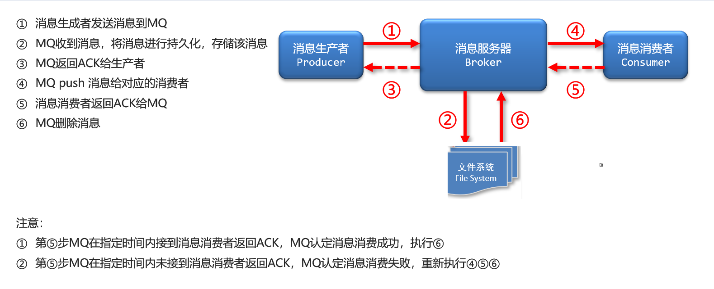
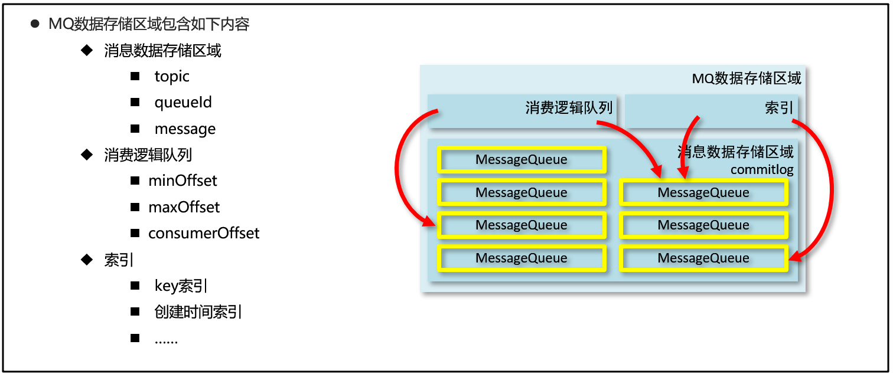

# RocketMQ_day02

# 1. 集群

- 多个broker提供服务

- 多个master多个slave

  ​	master到slave消息同步方式为同步（较异步方式性能略低，消息无延迟）

  ​	master到slave消息同步方式为异步（较同步方式性能略高，数据略有延迟）

## 1.1. 集群特征

```

NameServer是一个几乎无状态节点，可集群部署，节点之间无任何信息同步。
Broker部署相对复杂，Broker分为Master与Slave，一个Master可以对应多个Slave，但是一个Slave只能对应一个Master，Master与Slave的对应关系通过指定相同的BrokerName，不同的BrokerId来定义，BrokerId为0表示Master，非0表示Slave。Master也可以部署多个。每个Broker与NameServer集群中的所有节点建立长连接，定时注册Topic信息到所有NameServer。
Producer与NameServer集群中的其中一个节点（随机选择）建立长连接，定期从NameServer取Topic路由信息，并向提供Topic服务的Master建立长连接，且定时向Master发送心跳。Producer完全无状态，可集群部署。
Consumer与NameServer集群中的其中一个节点（随机选择）建立长连接，定期从NameServer取Topic路由信息，并向提供Topic服务的Master、Slave建立长连接，且定时向Master、Slave发送心跳。Consumer既可以从Master订阅消息，也可以从Slave订阅消息，订阅规则由Broker配置决定。
```

**总结:** 

```
1) nameserver有 多个
2) master  多个,每个master 都有多个 slave
3) master 的 brokerid =0 , slave 的  brokerid 非0 
4) 多个 master 和多个slave  如果 brokername 相同则 为一组
5) master 和slave 会将自己注册到每一台 nameserver 上 
```


## 1.2集群的工作流程

```
步骤1：NameServer启动，开启监听，等待broker、producer与consumer连接
步骤2：broker启动，根据配置信息，连接所有的NameServer，并保持长连接
步骤2补充：如果broker中有现存数据， NameServer将保存topic与broker关系
步骤3：producer发信息，连接某个NameServer，并建立长连接
步骤4：producer发消息
    步骤4.1若果topic存在，由NameServer直接分配
    步骤4.2如果topic不存在，由NameServer创建topic与broker关系，并分配
步骤5：producer在broker的topic选择一个消息队列（从列表中选择）
步骤6：producer与broker建立长连接，用于发送消息
步骤7：producer发送消息

comsumer工作流程同producer
```

## 1.3 搭建

**1) 配置主机名称(未来就可以根据主机名找到对应的服务器了)**

vim /etc/hosts

```sh
# nameserver
192.168.184.128 rocketmq-nameserver1
192.168.184.129 rocketmq-nameserver2
# broker
192.168.184.128 rocketmq-master1
192.168.184.129 rocketmq-slave2
192.168.184.129 rocketmq-master2
192.168.184.128 rocketmq-slave1
```

配置完毕后重启网卡，应用配置

```sh
systemctl restart network
```

**2) 关闭防火墙**

```
# 关闭防火墙
systemctl stop firewalld.service 
# 查看防火墙的状态
firewall-cmd --state 
# 禁止firewall开机启动
systemctl disable firewalld.service
```

**3) 配置jdk** 

```
详见day01
```

**4) 配置服务器环境**

将rocketmq 解压至跟目录   /

```
# 解压
unzip rocketmq-all-4.5.2-bin-release.zip
# 修改目录名称
mv rocketmq-all-4.5.2-bin-release rocketmq
```

vim /etc/profile

```
#set rocketmq
ROCKETMQ_HOME=/rocketmq
PATH=$PATH:$ROCKETMQ_HOME/bin
export ROCKETMQ_HOME PATH
```

```
配置完毕后重启网卡，应用配置
source /etc/profile
```

**5) 创建集群服务器的数据存储目录**

主节点创建四个目录/ 从节点四个目录

```
mkdir /rocketmq/store
mkdir /rocketmq/store/commitlog
mkdir /rocketmq/store/consumequeue
mkdir /rocketmq/store/index


mkdir /rocketmq-slave/store
mkdir /rocketmq-slave/store/commitlog
mkdir /rocketmq-slave/store/consumequeue
mkdir /rocketmq-slave/store/index
```

```
注意master与slave如果在同一个虚拟机中部署，需要将存储目录区分开
```

**6)  修改配置**

(不同的节点,应该修改不同的配置,文件夹也应该不一样

```
>cd r/ocketmq/conf/2m-2s-sync
>vim  broker-a.proerties  
```

```
#所属集群名字
brokerClusterName=rocketmq-cluster
#broker名字，注意此处不同的配置文件填写的不一样
brokerName=broker-a
#0 表示 Master，>0 表示 Slave
brokerId=1
#nameServer地址，分号分割
namesrvAddr=rocketmq-nameserver1:9876;rocketmq-nameserver2:9876
#在发送消息时，自动创建服务器不存在的topic，默认创建的队列数
defaultTopicQueueNums=4
#是否允许 Broker 自动创建Topic，建议线下开启，线上关闭
autoCreateTopicEnable=true
#是否允许 Broker 自动创建订阅组，建议线下开启，线上关闭
autoCreateSubscriptionGroup=true
#Broker 对外服务的监听端口
listenPort=11011
#删除文件时间点，默认凌晨 4点
deleteWhen=04
#文件保留时间，默认 48 小时
fileReservedTime=48

#commitLog每个文件的大小默认1G
mapedFileSizeCommitLog=1073741824
#ConsumeQueue每个文件默认存30W条，根据业务情况调整
mapedFileSizeConsumeQueue=300000
#destroyMapedFileIntervalForcibly=120000
#redeleteHangedFileInterval=120000
#检测物理文件磁盘空间
diskMaxUsedSpaceRatio=88
#存储路径
storePathRootDir=/rocketmq/store-slave
#commitLog 存储路径
storePathCommitLog=/rocketmq/store-slave/commitlog
#消费队列存储路径存储路径
storePathConsumeQueue=/rocketmq/store-slave/consumequeue
#消息索引存储路径
storePathIndex=/rocketmq/store-slave/index
#checkpoint 文件存储路径
storeCheckpoint=/rocketmq/store-slave/checkpoint
#abort 文件存储路径
abortFile=/rocketmq


#限制的消息大小
maxMessageSize=65536
#flushCommitLogLeastPages=4
#flushConsumeQueueLeastPages=2
#flushCommitLogThoroughInterval=10000
#flushConsumeQueueThoroughInterval=60000
#Broker 的角色
#- ASYNC_MASTER 异步复制Master
#- SYNC_MASTER 同步双写Master
#- SLAVE
brokerRole=SLAVE
#刷盘方式
#- ASYNC_FLUSH 异步刷盘
#- SYNC_FLUSH 同步刷盘
flushDiskType=SYNC_FLUSH
#checkTransactionMessageEnable=false
#发消息线程池数量
#sendMessageThreadPoolNums=128
#拉消息线程池数量
#pullMessageThreadPoolNums=128
```

检查启动内存 (nameserver 和broker 均需要修改)

```

vim /rocketmq/bin/runbroker.sh
vim /rocketmq/bin/runserver.sh

# 开发环境配置 JVM Configuration
JAVA_OPT="${JAVA_OPT} -server -Xms256m -Xmx256m -Xmn128m"

```

 启动(bin 目录)

```
nohup sh mqnamesrv &
nohup sh mqbroker -c ../conf/2m-2s-syncbroker-a.properties &
nohup sh mqbroker -c ../conf/2m-2s-sync/broker-b-s.properties &
```

# 2. rocketmq-console

```
rocketmq-console是一款基于java环境开发的（springboot）的管理控制台工具
获取地址：https://github.com/apache/rocketmq-externals
```

# 3 高级特性介绍

## 3.1  消息的存储(消息存在哪儿?)

ActiveMQ  使用了数据库的消息存储,
缺点：数据库瓶颈将成为MQ瓶颈


```
RocketMQ/Kafka/RabbitMQ
不用数据库,直接用文件存储(如下)
```





## 3.2 MQ 高效的消息存储与读写方式

```
1) 通过启动时初始化话文件大小来保证 占用固定的磁盘空间,保证磁盘读写速度
2) 零拷贝”技术
	数据传输由传统的4次复制简化成3次复制(如下图)，减少1次复制过程
	Java语言中使用MappedByteBuffer类实现了该技术
	要求：预留存储空间，用于保存数据（1G存储空间起步）

```


3.3 消息存储结构

```
消息数据存储区域
    topic
    queueId
    message
消费逻辑队列
    minOffset
    maxOffset
    consumerOffset
索引
    key索引
    创建时间索引
    ……

```



## 3.4 刷盘机制

### 3.4.1  同步刷盘

```
1)生产者发送消息到MQ，MQ接到消息数据
2)MQ挂起生产者发送消息的线程
3)MQ将消息数据写入内存
4)内存数据写入硬盘
5)磁盘存储后返回SUCCESS
6)MQ恢复挂起的生产者线程
7)发送ACK到生产者
```


### 3.4.2 异步刷盘

```
1)生产者发送消息到MQ，MQ接到消息数据
2)MQ将消息数据写入内存
3)发送ACK到生产者
--等消息量多了--
4)内存数据写入硬盘
```


### 3.4.3 同步刷盘/ 异步刷盘 优缺点对比

```
同步刷盘：安全性高，效率低，速度慢（适用于对数据安全要求较高的业务）
异步刷盘：安全性低，效率高，速度快（适用于对数据处理速度要求较高的业务）

```

### 3.4.4 配置方式

```
#刷盘方式
#- ASYNC_FLUSH 异步刷盘
#- SYNC_FLUSH 同步刷盘
flushDiskType=SYNC_FLUSH
```

## 4. 高可用性

nameserver

```
nameserver ,通过无状态+全服务器注册 来保证即使一个宕机了也能提供所有的服务

```

消息服务器

```
主从架构（2M-2S） ,即使又一台服务器宕机, 服务依旧可以正常提供
注意: master 一旦宕机,slave 只提供消费服务,不能写入新的消息(slave 不会升级为master)

```

消息生产(开发人员写代码时保障)

```
生产者将相同的topic绑定到多个group组，保障master挂掉后，其他master仍可正常进行消息接收
```

消息消费

```
RocketMQ自身会根据master的压力确认是否由master承担消息读取的功能，当master繁忙时候，自动切换由slave承担数据读取的工作
```

# 5. 主从数据复制

## 5.1 同步复制

```
master接到消息后，先复制到slave，然后反馈给生产者写操作成功
优点：数据安全，不丢数据，出现故障容易恢复
缺点：影响数据吞吐量，整体性能低
```

## 5.2 异步复制

```
master接到消息后，立即返回给生产者写操作成功，当消息达到一定量后再异步复制到slave
优点：数据吞吐量大，操作延迟低，性能高
缺点：数据不安全，会出现数据丢失的现象，一旦master出现故障，从上次数据同步到故障时间的数据将丢失
```

5.3 配置(配置在启动时 -c 指定的配置文件中  broker.conf)

```
#Broker 的角色
#- ASYNC_MASTER 异步复制Master
#- SYNC_MASTER 同步双写Master
#- SLAVE
brokerRole=SYNC_MASTER
```


# 6 负载均衡

- Producer负载均衡

  内部实现了不同broker集群中对同一topic对应消息队列的负载均衡

- Consumer负载均衡

  平均分配 

  循环平均分配

# 7. 消息重试

当消息消费后未正常返回消费成功的信息将启动消息重试机制

## 7.1 顺序消息重试

```
当消费者消费消息失败后，RocketMQ会自动进行消息重试（每次间隔时间为 1 秒）
注意：应用会出现消息消费被阻塞的情况，因此，要对顺序消息的消费情况进行监控，避免阻塞现象的发生
```

## 7.2 无序消息重试

```
无序消息包括普通消息、定时消息、延时消息、事务消息
无序消息重试仅适用于负载均衡（集群）模型下的消息消费，不适用于广播模式下的消息消费
为保障无序消息的消费，MQ设定了合理的消息重试间隔时长
```


# 8. 死信队列

## 8.1 概念

```
当消息消费重试到达了指定次数（默认16次）后，MQ将无法被正常消费的消息称为死信消息（Dead-Letter Message）
死信消息不会被直接抛弃，而是保存到了一个全新的队列中，该队列称为死信队列（Dead-Letter Queue）
```

## 8.2 死信队列特征

```
- 归属某一个组（Gourp Id），而不归属Topic，也不归属消费者
- 一个死信队列中可以包含同一个组下的多个Topic中的死信消息
- 死信队列不会进行默认初始化，当第一个死信出现后，此队列首次初始化

```

## 8.3 死信队列中消息特征

```
- 不会被再次重复消费
- 死信队列中的消息有效期为3天，达到时限后将被清除
```

## 8.4 死信处理

```
在监控平台中，通过查找死信，获取死信的messageId，然后通过id对死信进行精准消费
```

# 9. 消息重复消费与 消息幂等

## 9.1 消息重复消费原因

```
1 生产者发送了重复的消息
    网络闪断
    生产者宕机
2 消息服务器投递了重复的消息
	网络闪断
3 动态的负载均衡过程
    网络闪断/抖动
    broker重启
    订阅方应用重启（消费者）
    客户端扩容
    客户端缩容
```

## 9.2 消息幂等

```
对同一条消息，无论消费多少次，结果保持一致，称为消息幂等性
```

### 9.2.1 解决方案

```
- 使用业务id作为消息的key
- 在消费消息时，客户端对key做判定，未使用过放行，使用过抛弃
```

注意：messageId由RocketMQ产生，messageId并不具有唯一性，不能作用幂等判定条件